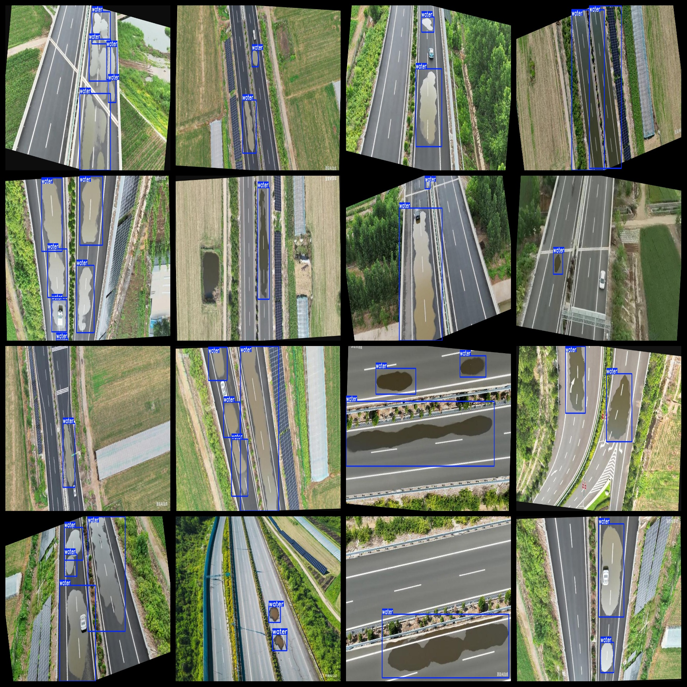

# Aerial Highway Waterlogging Road Waterlogging Dataset: 2802 images in VOC+YOLO format.

The dataset is organized in Pascal VOC format plus YOLO format (excluding the split path's txt file, only containing jpg images and corresponding VOC-format xml files and yolo-format txt files).

Number of images in jpg format: 2802

Number of xml files: 2802

Number of txt files: 2802

Number of categories: 1

Repository where the dataset is stored: datasets_sl

Category name for annotations: ["water"]

Number of bounding boxes per category:

Water bounding box count = 7353

Total number of bounding boxes: 7353

Number of images per category:

Water images count = 2802

Image resolution: 1312x735

Annotation tool used: labelImg

Dataset enhancement status: Yes

Annotation rules: Draw bounding boxes for categories

Important Notice: The dataset does not have been divided into training, validation, or test sets; you need to divide them yourself.

Special Remark: This dataset does not guarantee the accuracy of the trained models or weight files.

Annotation and image details are as follows:

## Images

---

Here is a pay link on Stripe (https://buy.stripe.com/3cs8yP7sY87d0vu9AB). Please contact me lonlonago@foxmail.com after funding $89, and I will send you a complete data files, thank you!

